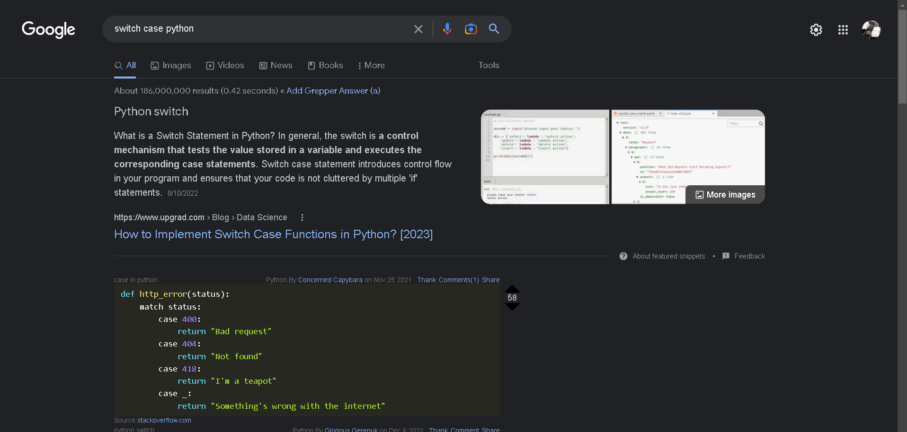
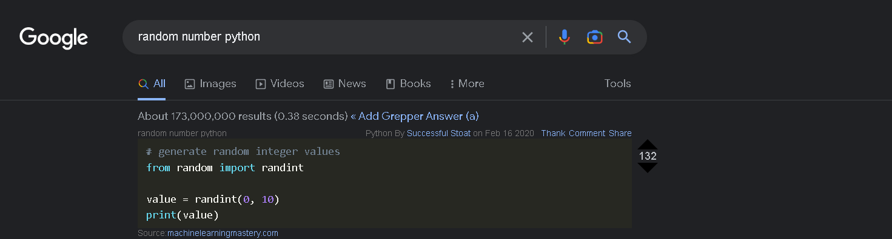
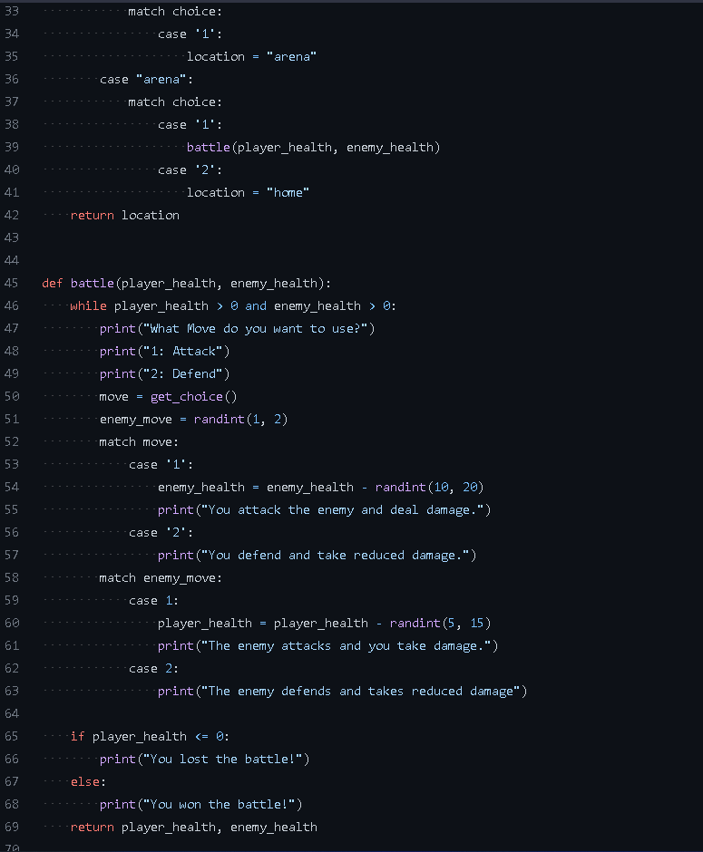
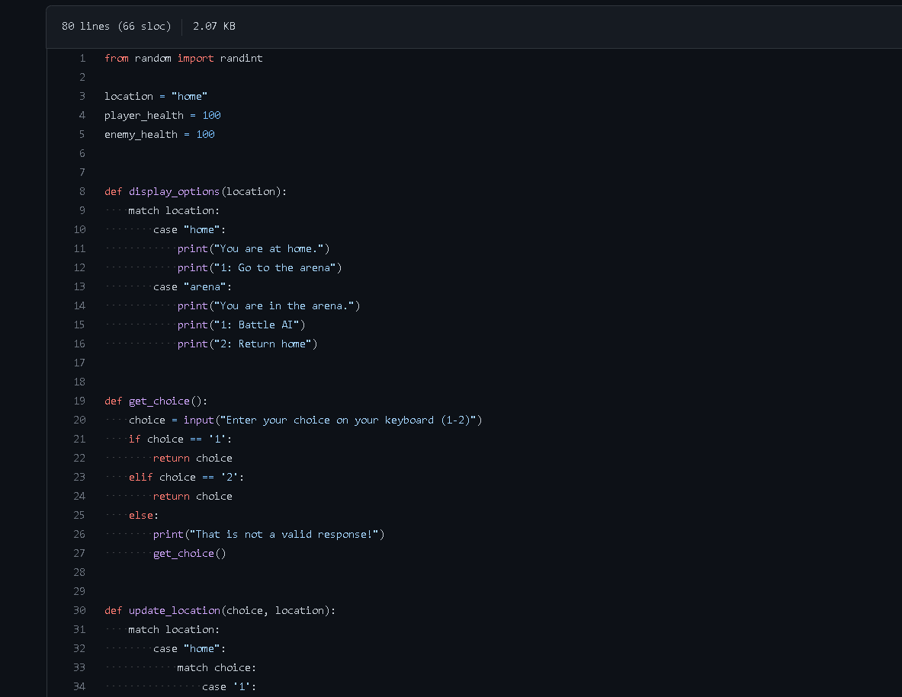
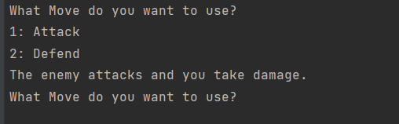
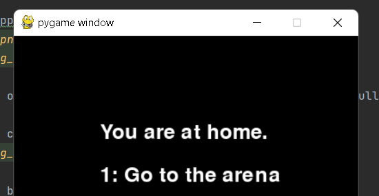
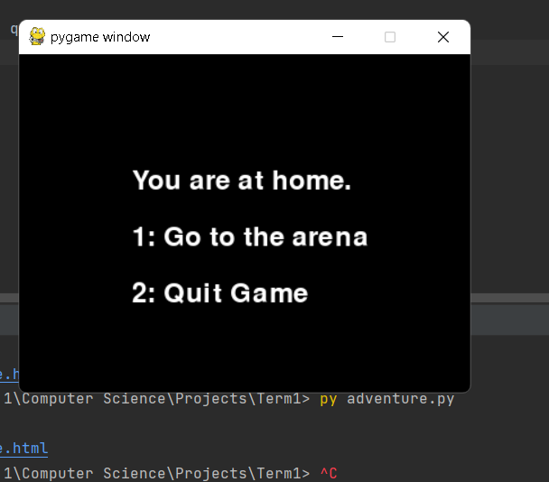

- Created a new folder in my 2023 term 1 onedrive, used for auto saving
- Installed PyCharm EDU and created a new project.
- Installed the latest version of Python and set my PyCharm interpreter to use it.
- Created a .gitignore using Githubs official .gitignore repo's for both Python &
  Jetbrains (https://github.com/github/gitignore/blob/main/Python.gitignore
  / https://github.com/github/gitignore/blob/main/Global/JetBrains.gitignore)
- Inited a base GitHub repo using git cmd line, connected it to my Term1 GitHub Repo
- Followed the sudo code and re-created it in python. Used a lot of google/stack overflow
- I've got extremely limited knowledge in Python but sufficient knowledge in other languages that I was able to
  effectively use google to re-create the game in a relatively quick timespan.
- Using Grepper was incredibly helpful for quick and mostly accurate answers.

Snapshot of Grepper results: 

- With the help of Google and the sudo code, I was able to successfully create the game in the Python Terminal.

Snapshot of the code for the base game: 

Snapshot of the base-game working in PyCharm's terminal:

- I was then challenged to put the game into GUI form, using either pygame or PyQt5. 
- After sufficient research, I decided on pygame because of its flexibility, and its extensive documentation, and support community.
- Having never used pygame before, I used pygames 'examples' category and spent a lot of time looking at other games and how they use pygames library.
- https://github.com/pygame/pygame/tree/main/examples
- I then started work on the GUI. Following pycharm's docs and referencing the example repositries, I managed to get a very basic GUI working for the location selector screen.

Snapshot of the home menu in a pygame gui:

- I continued to work on developing the GUI, however I decided to implement a 'quit game' selection on the home menu, as quitting the GUI became increasingly difficult

Snapshot of the quit game button on the home menu:

